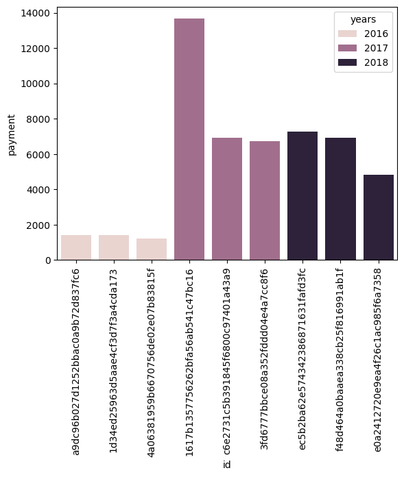
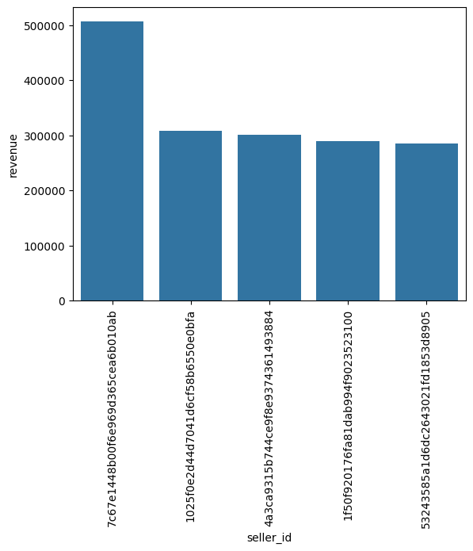
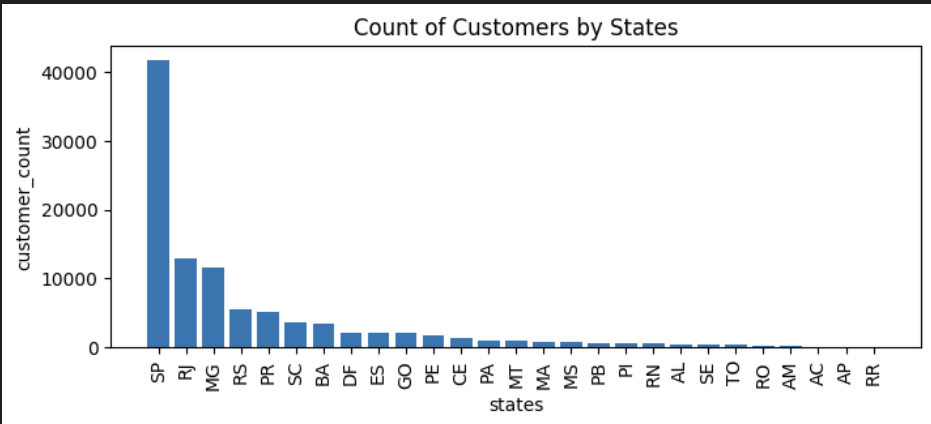
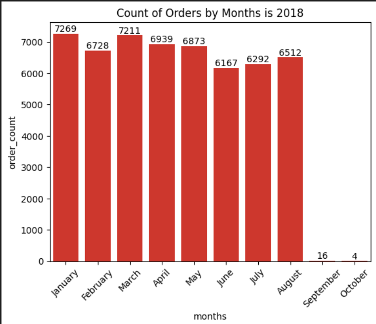

# 🛒 Ecommerce Sales Analysis using SQL and Python

This project presents a comprehensive analysis of an e-commerce dataset using **SQL** for querying and **Python** for data exploration and visualization. The goal is to derive meaningful business insights such as customer behavior, sales performance, seller rankings, and revenue trends.

## 📌 Project Objectives

- Perform Exploratory Data Analysis (EDA) using Python.
- Extract insights using SQL queries.
- Address real-world business questions from the dataset.
- Visualize key metrics such as revenue, orders, retention, and customer geography.

## 🧰 Tools & Technologies

- **SQL** – Data querying
- **Python** – Data analysis & EDA
- **Libraries** – `Pandas`, `Matplotlib`, `Seaborn`, `NumPy`, `Pymysql`
- **Jupyter Notebook** – Interactive EDA

## 📂 Folder Structure
```
ecommerce-analysis-project/
│
├── python_sql_ecommerce.ipynb # Python EDA and SQL scripts notebook
├── images/ # Visualizations used in README
│ ├── top_customers_by_year.png
│ ├── revenue_by_seller.png
│ ├── customers_by_state.png
│ └── orders_by_month_2018.png
├── ecom_csv_to_sql.py # Script to load CSV to SQL
├── dataset_link.txt # Dataset source
├── Questions.txt # Business Queries to Solve
└── README.md # Project documentation
```

## 🔍 Business Problems Solved

### 🔹 Basic Queries
1. Unique cities where customers are located.
2. Count of orders placed in 2017.
3. Total sales per category.
4. Percentage of installment-based orders.
5. Customer distribution by state.

### 🔸 Intermediate Queries
1. Monthly order volume in 2018.
2. Average products per order by city.
3. Revenue % contribution by category.
4. Correlation between product price and purchase frequency.
5. Seller revenue rankings.

### 🔺 Advanced Queries
1. Moving average of customer order values.
2. Cumulative sales per month by year.
3. Year-over-year growth rate of sales.
4. Customer retention within 6 months.
5. Top 3 customers by yearly spend.

## 📊 Visualizations

## 📊 Top Customers by Year

### 🏆 Top Customers  
  
Shows top 3 high-spending customers in each year.

---

## 💰 Seller Revenue Ranking

### 💸 Revenue by Seller  
  
Ranks sellers based on total revenue generated.

---

## 🌍 Customer Distribution by State

### 📍 Customers by State  
  
Breakdown of customer count by state — SP leads significantly.

---

## 📅 Orders by Month in 2018

### 📊 Orders by Month 2018  
  
Reveals seasonal pattern and order drop in Sept–Oct 2018.


## 📈 Key Insights

- **SP** (São Paulo) dominates in customer volume and sales.
- A few sellers and customers contribute to a large portion of total revenue.
- Orders peaked between Jan–July 2018, with significant drop later.
- Installment payments are preferred by many customers.
- Repeat customer activity can be improved with loyalty strategies.

## 🔮 Future Enhancements
- Build interactive dashboards in Power BI/Tableau.
- Add customer churn prediction model.
- Automate monthly sales and revenue reports.

## 👤 Author
Shivangi 

